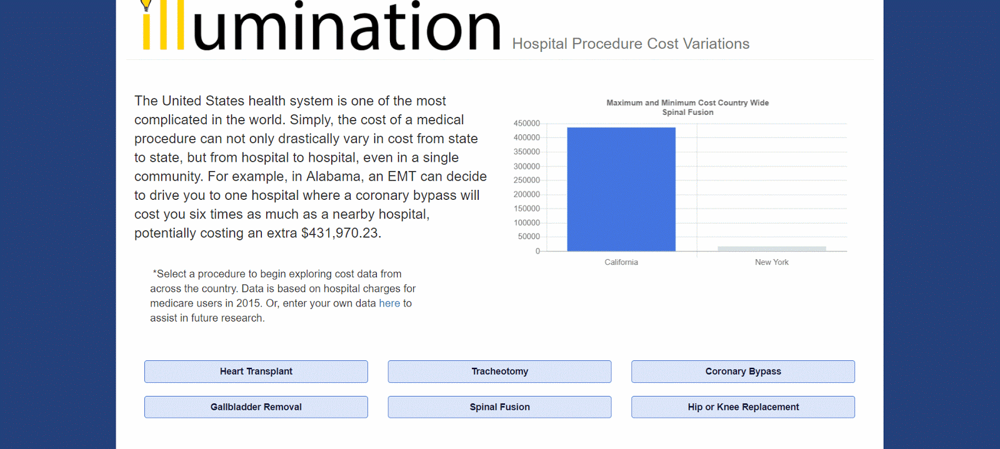
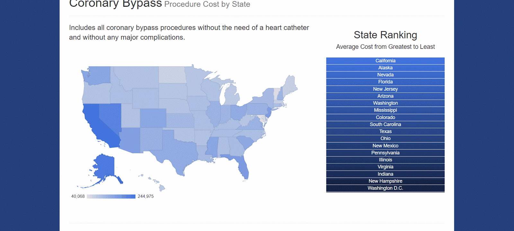
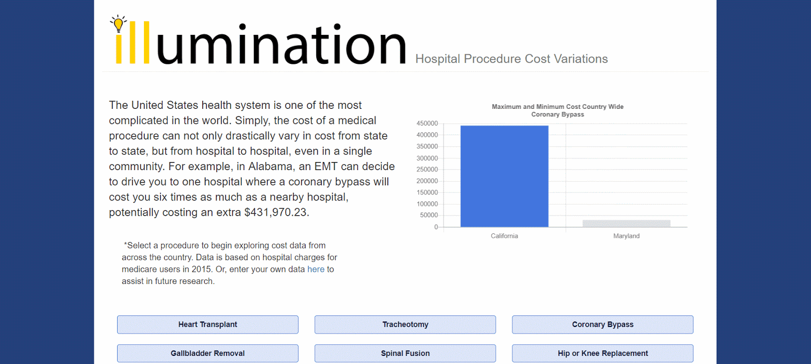

# Illumination: Showing the Real Cost of Care

### Synopsis

Illumination is a web-based application that provides the highest and lowest costs of procedures in individual U.S. states.  In this first build, we are highlighting the costs of:

* Tracheotomies 
* Hip or Knee Replacements
* Heart Transplants
* Coronary Bypasses
* Spinal Fusions
  and
* Gallblader Removals

In future builds, we plan on including a more extensive list of procedures and additional user functionality, such as integration for mobile and tablet and a more robust structure for users to contribute to our database with their own experiences.  

### Motivation

We found a dataset of Medicare Inpatient Provider Charges that both shocked and disgusted us, and we thought it'd be great to visualize this data in a way that would be both informative and fun to play with.  

### App In Action

#### Overview of Procedures

#### Countrywide View of a Procedure

#### Statewide View of a Procedure

#### Patient Data Entry

### Built With

* Javascript + jQuery
* Handlebars.js
* MySQL + Sequelize
* Body-Parser
* Express
* Heroku

### Authors

* Michael Doherty
* Brian Hagy
* Spencer Hawk
* Umer Rathore
